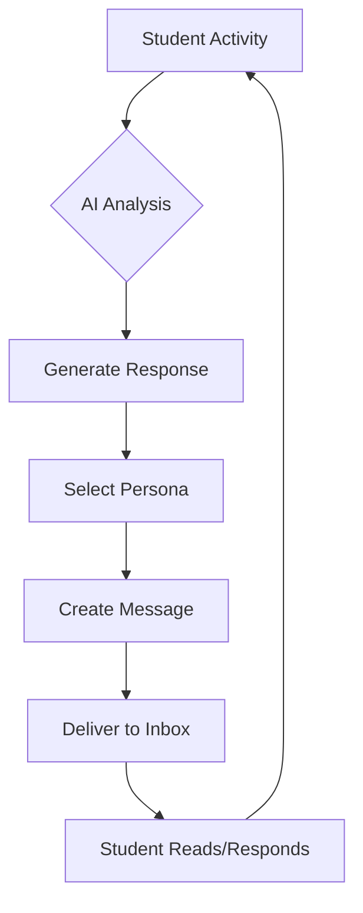

# 🎯 **Virtual Internship Email & AI Supervisor System - Functional Overview**

## 🌟 **Core Purpose**

The Email Messaging and AI Supervisor system is the **heart of our virtual internship experience**. It creates an authentic, engaging, and supportive internship environment by simulating realistic workplace communication and mentorship.

### **Why This Matters:**
1. **Real-world feel** - Students experience professional workplace communication
2. **Active guidance** - AI provides timely, contextual support
3. **Skill development** - Practice professional communication in a safe environment
4. **Engagement** - Creates a "living" internship experience vs. static tasks

## 💌 **The Email Experience**

### **What Students See:**
- A professional email inbox interface
- Messages from their supervisor (Sarah Mitchell)
- Communications from team members
- Task-related updates and reminders
- Feedback and encouragement

### **How It Works:**
```typescript
Student Experience:
1. Log into virtual internship dashboard
2. Access email-style inbox with professional messages
3. Receive contextual communications based on their progress
4. Reply to messages and get AI-powered responses
5. Practice professional communication skills
```

## 🤖 **The AI Supervisor**

### **Core Role: "Sarah Mitchell, Internship Coordinator"**
Sarah is the primary AI persona who guides students through their internship. She's designed to be:
- Professional but approachable
- Encouraging and supportive
- Knowledgeable about the industry
- Responsive to student needs

### **Key Interactions:**

#### **1. Onboarding Welcome**
```typescript
When: Student starts internship
Purpose: Set expectations and welcome
Example: "Welcome to your Marketing Analytics internship! I'm Sarah Mitchell, 
         and I'll be your internship coordinator. We've got some exciting 
         projects lined up..."
```

#### **2. Task Check-ins**
```typescript
When: Based on task progress/deadlines
Purpose: Proactive support and guidance
Example: "I noticed you're working on the market research task. 
         How's it going? Let me know if you need any clarification 
         on the data analysis requirements..."
```

#### **3. Feedback Follow-ups**
```typescript
When: After task submissions
Purpose: Reinforce learning and encourage growth
Example: "Great work on your campaign analysis! Your insights about 
         the target demographic were particularly strong. For your 
         next task, consider..."
```

#### **4. Progress Monitoring**
```typescript
When: Regular intervals + triggered by activity
Purpose: Keep students engaged and on track
Example: "You've completed 3 tasks this week - excellent progress! 
         Looking ahead, we have the social media strategy task 
         coming up..."
```

## 👥 **Team Member Interactions**

### **Purpose:**
Create a realistic workplace environment by simulating interactions with different team members.

### **Example Personas:**
```typescript
1. Technical Lead:
   - Reviews technical submissions
   - Provides specialized guidance
   - Shares industry insights

2. Project Manager:
   - Discusses project timelines
   - Provides workflow tips
   - Offers organizational guidance

3. Team Members:
   - Share experiences
   - Offer peer support
   - Discuss collaboration
```

## 🎯 **Key Features in Action**

### **1. Contextual Awareness**
```typescript
System monitors:
- Task progress
- Submission quality
- Activity patterns
- Time management
- Skill development

Then generates:
- Relevant check-ins
- Timely reminders
- Personalized feedback
- Encouraging messages
```

### **2. Professional Communication Training**
```typescript
Students practice:
- Email etiquette
- Business writing
- Status updates
- Question asking
- Feedback responses
```

### **3. Intelligent Scheduling**
```typescript
System schedules messages based on:
- Task deadlines
- Student activity
- Progress milestones
- Learning needs
- Engagement patterns
```

## 💡 **Educational Value**

### **1. Professional Skills Development**
- Email communication
- Business writing
- Time management
- Task updates
- Question formulation

### **2. Workplace Readiness**
- Professional interaction experience
- Feedback reception practice
- Remote work communication
- Team collaboration skills
- Status reporting

### **3. Confidence Building**
- Safe environment for practice
- Constructive feedback
- Positive reinforcement
- Skill recognition
- Growth tracking

## 🔄 **Interaction Flow**



## 🎯 **Success Metrics**

### **1. Engagement Indicators**
- Message open rates
- Response rates
- Response quality
- Task completion correlation
- Time to response

### **2. Learning Outcomes**
- Communication quality improvement
- Professional writing development
- Task performance correlation
- Feedback implementation
- Skill progression

### **3. Experience Quality**
- Student satisfaction
- Interaction naturalness
- Support effectiveness
- Guidance relevance
- Response helpfulness

## 🚀 **Real-World Impact**

### **What Students Gain:**
1. **Professional Communication Experience**
   - Real-world email practice
   - Business writing skills
   - Professional etiquette

2. **Mentorship Experience**
   - Structured guidance
   - Professional feedback
   - Career insights

3. **Workplace Simulation**
   - Team interaction practice
   - Task management experience
   - Professional relationship building

## 📈 **System Intelligence**

### **How the AI Makes Decisions:**
```typescript
1. Context Analysis:
   - Task status
   - Student progress
   - Recent activity
   - Time patterns
   - Performance metrics

2. Interaction Planning:
   - Message timing
   - Content relevance
   - Persona selection
   - Tone adjustment
   - Support level

3. Response Generation:
   - Professional formatting
   - Contextual content
   - Personalized guidance
   - Appropriate tone
   - Clear action items
```

## 🎯 **Implementation Goals**

### **1. Authenticity**
- Professional email environment
- Realistic workplace interactions
- Natural communication flow
- Genuine mentorship experience

### **2. Educational Value**
- Skill development
- Professional growth
- Practical experience
- Confidence building

### **3. Engagement**
- Regular interaction
- Meaningful exchanges
- Supportive guidance
- Progress motivation

## 💡 **Key Takeaway**

The Email & AI Supervisor system transforms a virtual internship from a series of tasks into a living, breathing professional experience. It provides the guidance, interaction, and skill development opportunities that make virtual internships valuable for career preparation.

By combining professional email communication with intelligent AI supervision, we create an environment where students can develop workplace skills, receive mentorship, and gain confidence in their professional abilities - all in a safe, supportive setting that prepares them for real-world success.

