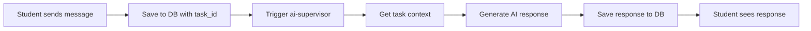

# 🤖 Auto-Response Implementation Guide

## 🎯 **Goal**
When a student sends a message, Sarah immediately responds with contextual advice.

---

## 🔧 **Implementation Steps**

### **Step 1: Add Task Context Dropdown**

Update `EmailMessagingPanel.tsx` compose view:

```typescript
// Add to component state
const [selectedTaskId, setSelectedTaskId] = useState<string>('');
const [availableTasks, setAvailableTasks] = useState<any[]>([]);

// Load tasks when component mounts
useEffect(() => {
  const loadTasks = async () => {
    if (!user) return;
    
    const { data: tasks } = await supabase
      .from('internship_tasks')
      .select('id, title, status, due_date')
      .eq('session_id', sessionId)
      .neq('status', 'completed')
      .order('due_date', { ascending: true });
    
    setAvailableTasks(tasks || []);
  };
  
  if (sessionId) {
    loadTasks();
  }
}, [sessionId, user]);

// In compose view, add dropdown before message textarea:
<div>
  <label className="text-sm font-medium">Related Task (Optional)</label>
  <Select value={selectedTaskId} onValueChange={setSelectedTaskId}>
    <SelectTrigger className="mt-1">
      <SelectValue placeholder="Select a task for context..." />
    </SelectTrigger>
    <SelectContent>
      <SelectItem value="">General Question</SelectItem>
      {availableTasks.map((task) => (
        <SelectItem key={task.id} value={task.id}>
          {task.title} {daysUntil(task.due_date) <= 3 && '⏰'}
        </SelectItem>
      ))}
    </SelectContent>
  </Select>
</div>
```

### **Step 2: Modify sendUserReply Service**

Update `src/services/aiSupervisor.ts`:

```typescript
/**
 * Send user reply and trigger AI response
 */
static async sendUserReply(
  sessionId: string,
  userId: string,
  subject: string,
  content: string,
  threadId?: string,
  taskId?: string  // NEW: Optional task context
): Promise<void> {
  try {
    // 1. Save user message
    const { data: userMessage, error } = await supabase
      .from('internship_supervisor_messages')
      .insert({
        session_id: sessionId,
        user_id: userId,
        message_type: 'user_message',
        subject: subject,
        message_content: content,
        direction: 'inbound',
        sender_type: 'user',
        thread_id: threadId,
        status: 'sent',
        sent_at: new Date().toISOString(),
        is_read: false,
        context_data: { task_id: taskId } // Store task context
      })
      .select()
      .single();

    if (error) throw error;

    // 2. Trigger AI response immediately
    const { error: responseError } = await supabase.functions.invoke('ai-supervisor', {
      body: {
        action: 'user_message_response',
        session_id: sessionId,
        user_id: userId,
        context: {
          user_message_id: userMessage.id,
          user_message_content: content,
          user_message_subject: subject,
          task_id: taskId,
          thread_id: threadId
        }
      }
    });

    if (responseError) {
      console.error('Error triggering AI response:', responseError);
      // Don't throw - user message was saved successfully
    }
  } catch (error) {
    console.error('Error in sendUserReply:', error);
    throw error;
  }
}
```

### **Step 3: Add New Action to ai-supervisor Edge Function**

Update `supabase/functions/ai-supervisor/index.ts`:

```typescript
// Add to interface
interface SupervisorRequest {
  action: 'onboarding' | 'check_in' | 'feedback_followup' | 'reminder' | 'user_message_response';
  session_id: string;
  user_id: string;
  context?: {
    task_id?: string;
    submission_id?: string;
    feedback_data?: any;
    user_message_id?: string;      // NEW
    user_message_content?: string; // NEW
    user_message_subject?: string; // NEW
    thread_id?: string;           // NEW
  };
}

// Add to switch statement
switch (action) {
  case 'onboarding':
    result = await handleOnboarding(supabase, ctx, context);
    break;
  case 'check_in':
    result = await handleCheckIn(supabase, ctx, context);
    break;
  case 'feedback_followup':
    result = await handleFeedbackFollowup(supabase, ctx, context);
    break;
  case 'reminder':
    result = await handleReminder(supabase, ctx, context);
    break;
  case 'user_message_response':  // NEW
    result = await handleUserMessageResponse(supabase, ctx, context);
    break;
  default:
    throw new Error(`Unknown action: ${action}`);
}

// Add new handler function
async function handleUserMessageResponse(
  supabase: any, 
  context: SupervisorContext, 
  requestContext: any
) {
  const startTime = Date.now();
  const { 
    user_message_id, 
    user_message_content, 
    user_message_subject,
    task_id,
    thread_id 
  } = requestContext;

  try {
    if (!user_message_id || !user_message_content) {
      throw new Error('user_message_id and user_message_content required');
    }

    // Create idempotency key based on user message
    const idem_key = mkIdem('response', context.session_id, context.user_id, user_message_id);

    // Get task context if provided
    let taskContext = null;
    if (task_id) {
      const { data: task } = await supabase
        .from('internship_tasks')
        .select('id, title, description, due_date, status, requirements')
        .eq('id', task_id)
        .single();
      taskContext = task;
    }

    // Get response template
    const { data: template } = await supabase
      .from('internship_supervisor_templates')
      .select('prompt_template')
      .eq('template_type', 'user_message_response')
      .eq('template_name', 'contextual_response')
      .eq('active', true)
      .limit(1)
      .single();

    const templateText = template?.prompt_template || 
      `You are Sarah Mitchell, an internship coordinator. A student sent you this message: "{user_message}". 
       ${task_id ? 'They mentioned it relates to the task: "{task_title}". ' : ''}
       Provide a helpful, encouraging response with specific guidance.`;

    const variables = {
      user_name: context.user_first_name,
      user_message: user_message_content,
      user_subject: user_message_subject,
      task_title: taskContext?.title || 'N/A',
      task_description: taskContext?.description || '',
      task_due_date: taskContext?.due_date || '',
      days_until_due: taskContext ? daysUntil(taskContext.due_date) : null
    };

    const fallbackMessage = `Hi ${context.user_first_name},

Thank you for your message! I appreciate you reaching out.

${taskContext ? 
  `Regarding "${taskContext.title}" - this is an important task and I'm glad you're being proactive about it. ` : 
  'I\'m here to help with any questions or concerns you might have. '
}

${user_message_content.toLowerCase().includes('question') ? 
  'Great questions show you\'re thinking critically about the work. ' : 
  'Your engagement with the internship is exactly what we like to see. '
}

Feel free to ask if you need any clarification or additional guidance. I'm here to support your success!

Best regards,
Sarah Mitchell
Internship Coordinator`;

    const messageContent = await renderTemplateOrFallback(
      templateText,
      variables,
      fallbackMessage
    );

    // Generate response subject
    const responseSubject = user_message_subject.startsWith('Re:') 
      ? user_message_subject 
      : `Re: ${user_message_subject}`;

    // Send response with idempotency
    const { data: message, error } = await supabase
      .from('internship_supervisor_messages')
      .insert({
        session_id: context.session_id,
        user_id: context.user_id,
        message_type: 'user_message_response',
        subject: responseSubject,
        message_content: messageContent,
        direction: 'outbound',
        sender_type: 'supervisor',
        thread_id: thread_id || user_message_id,
        context_data: { 
          variables, 
          responding_to: user_message_id,
          task_id: task_id 
        },
        status: 'sent',
        sent_at: new Date().toISOString(),
        idem_key: idem_key
      })
      .select()
      .single();

    if (error?.code === '23505') {
      return { message: 'Response already sent', skipped: true };
    }
    if (error) throw error;

    await supabase.rpc('increment_interactions', {
      p_session: context.session_id,
      p_user: context.user_id,
      p_inc: 1
    });

    console.log(`✅ User message response sent in ${Date.now() - startTime}ms`);

    return {
      message: 'Response generated and sent',
      message_id: message.id,
      duration_ms: Date.now() - startTime
    };

  } catch (error) {
    console.error('Error in user message response handler:', error);
    throw error;
  }
}
```

### **Step 4: Create Response Template**

Add to `internship_supervisor_templates` table:

```sql
INSERT INTO internship_supervisor_templates (
  template_type,
  template_name,
  prompt_template,
  variables,
  active
) VALUES (
  'user_message_response',
  'contextual_response',
  'You are Sarah Mitchell, a professional and supportive internship coordinator. 

A student named {user_name} sent you this message: "{user_message}"

Context:
- Subject: {user_subject}
- Related Task: {task_title}
- Task Description: {task_description}
- Days until task due: {days_until_due}

Provide a helpful, encouraging response that:
1. Acknowledges their message warmly
2. Addresses their specific question/concern
3. Provides actionable guidance related to the task (if applicable)
4. Encourages them to keep asking questions
5. Maintains a professional but supportive tone

Keep response to 100-150 words. Be specific and helpful.',
  '["user_name", "user_message", "user_subject", "task_title", "task_description", "days_until_due"]',
  true
);
```

### **Step 5: Update Frontend to Use Task Context**

Update `EmailMessagingPanel.tsx` compose and reply handlers:

```typescript
// In handleCompose function
const handleCompose = async () => {
  if (!composeSubject.trim() || !composeContent.trim() || !user || sending) return;

  setSending(true);
  try {
    await AISupervisorService.sendUserReply(
      sessionId,
      user.id,
      composeSubject.trim(),
      composeContent.trim(),
      undefined, // no thread_id for new message
      selectedTaskId || undefined // task context
    );

    setComposeSubject("");
    setComposeContent("");
    setSelectedTaskId(""); // Reset task selection
    setView('inbox');
    
    // Wait a moment for AI response, then reload
    setTimeout(() => {
      loadMessages();
    }, 2000);

    toast({
      title: "Message sent",
      description: "Your message has been sent. Sarah will respond shortly!",
    });
    
  } catch (error) {
    // ... error handling
  } finally {
    setSending(false);
  }
};

// Similar update for handleReply
const handleReply = async () => {
  if (!selectedMessage || !replyText.trim() || !user || sending) return;

  setSending(true);
  try {
    const replySubject = selectedMessage.subject.startsWith('Re:') 
      ? selectedMessage.subject 
      : `Re: ${selectedMessage.subject}`;

    await AISupervisorService.sendUserReply(
      sessionId,
      user.id,
      replySubject,
      replyText.trim(),
      selectedMessage.thread_id || selectedMessage.id,
      selectedTaskId || undefined // task context from dropdown
    );

    setReplyText("");
    setIsReplying(false);
    setSelectedTaskId(""); // Reset
    
    // Wait for AI response
    setTimeout(() => {
      loadMessages();
    }, 2000);

    toast({
      title: "Reply sent",
      description: "Your reply has been sent. Sarah will respond shortly!",
    });
    
  } catch (error) {
    // ... error handling
  } finally {
    setSending(false);
  }
};
```

---

## 🎯 **Complete User Flow**

### **Student Experience:**

1. **Click Compose** → Opens compose view
2. **Select Task** → Dropdown shows "Market Research Analysis ⏰" (due soon)
3. **Write Subject** → "Question about data sources"
4. **Write Message** → "Hi Sarah, I'm working on the market research task and wondering what data sources you'd recommend..."
5. **Click Send** → Message sent, toast shows "Sarah will respond shortly!"
6. **Wait 2-5 seconds** → AI response appears: "Hi Alex! Great question about data sources for your market research..."

### **Technical Flow:**



---

## ⚡ **Complexity Assessment**

### **Low Complexity** ✅
- **Database changes:** Just add template (1 SQL INSERT)
- **Edge Function:** Add 1 new handler (~50 lines)
- **Frontend:** Add dropdown + modify 2 functions (~30 lines)
- **Service:** Modify 1 function (~20 lines)

### **Total Implementation Time:** ~2-3 hours

### **Benefits:**
- ✅ Immediate engagement
- ✅ Contextual responses
- ✅ Task-specific guidance
- ✅ Natural conversation flow
- ✅ Uses existing idempotency system

---

## 🚀 **Alternative: Simpler Version**

If you want even simpler, skip the task dropdown and just respond to any message:

```typescript
// Just modify sendUserReply to always trigger response
await supabase.functions.invoke('ai-supervisor', {
  body: {
    action: 'user_message_response',
    session_id: sessionId,
    user_id: userId,
    context: {
      user_message_content: content,
      user_message_subject: subject
    }
  }
});
```

**Implementation time: ~1 hour**

---

## 🎯 **Recommendation**

**Go with the full implementation** - the task dropdown adds significant value:

1. **Better responses** - Sarah can give task-specific advice
2. **Learning opportunity** - Students learn to provide context
3. **Professional skill** - Real workplace communication includes context
4. **Minimal complexity** - Only ~100 lines of code total

**Ready to implement?** I can help you with any specific part! 🚀
