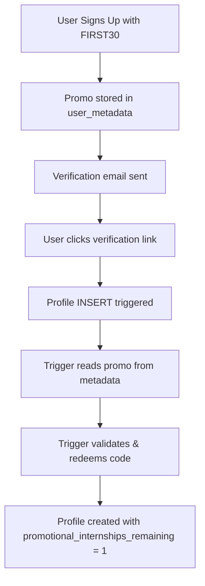

# Promo Code Auto-Redemption Fix

## 🐛 The Problem

When users signed up with the `FIRST30` promo code, the code was **not being applied** to their profile. Here's why:

### Root Cause
```typescript
// In useSignUpForm.ts - AFTER signup
const redemption = await redeemCode(promoCode, feedbackConsent);

// But in usePromoCode.ts - redeemCode checks:
if (!user) {
  return { success: false, error: "You must be signed in to redeem a promo code" };
}
```

**The issue:** After calling `supabase.auth.signUp()`, the user receives a verification email but **isn't authenticated yet**. The `redeemCode()` function requires an authenticated user, so it fails silently.

### The Flow That Was Failing:
1. User fills out signup form with promo code `FIRST30` ✅
2. Code stores promo code in `user_metadata` ✅
3. User signs up → verification email sent ✅
4. Code tries to call `redeemCode()` immediately ❌
5. But `user` is `null` until email verification
6. Redemption fails silently
7. Profile created with `promotional_internships_remaining = 0`

---

## ✅ The Solution

**Use a database trigger** to automatically redeem promo codes when the user's profile is first created (after email verification).

### How It Works:



### New Database Trigger:
- **File:** `supabase/migrations/20251211000001_add_promo_auto_redemption_trigger.sql`
- **Function:** `handle_new_user_promo_code()`
- **Trigger:** `auto_redeem_promo_code_on_profile_creation`
- **When:** `BEFORE INSERT ON profiles`

The trigger:
1. Reads `promo_code` and `feedback_consent` from `auth.users.raw_user_meta_data`
2. Validates the promo code
3. Creates a redemption record
4. Updates the promo code usage count
5. Sets `promotional_internships_remaining`, `promo_code_used`, and `feedback_consent` on the new profile

---

## 📋 How to Apply the Fix

### Step 1: Run the New Migration

1. Go to **Supabase Dashboard** → **SQL Editor**
2. Open and execute:
   ```
   /Users/jmugh/tuterra-2/supabase/migrations/20251211000001_add_promo_auto_redemption_trigger.sql
   ```

### Step 2: Verify the Trigger Was Created

```sql
-- Check if trigger exists
SELECT 
  trigger_name, 
  event_manipulation, 
  event_object_table,
  action_timing
FROM information_schema.triggers
WHERE trigger_name = 'auto_redeem_promo_code_on_profile_creation';

-- Should return 1 row with:
-- trigger_name: auto_redeem_promo_code_on_profile_creation
-- event_manipulation: INSERT
-- event_object_table: profiles
-- action_timing: BEFORE
```

### Step 3: Test with a New User

1. Create a new test account with promo code `FIRST30`
2. Verify email
3. Check profile:

```sql
SELECT 
  email,
  promotional_internships_remaining,
  promo_code_used,
  feedback_consent
FROM profiles
WHERE email = 'test@example.com';

-- Should show:
-- promotional_internships_remaining: 1
-- promo_code_used: FIRST30
-- feedback_consent: true (if they consented)
```

### Step 4: Fix Existing Test Users (Optional)

If you have test users who signed up but didn't get the promo applied:

```sql
-- Manually grant promo to existing users
-- Replace 'your-test-email@example.com' with actual email

UPDATE profiles
SET 
  promotional_internships_remaining = 1,
  promo_code_used = 'FIRST30',
  feedback_consent = true,
  feedback_consent_date = NOW()
WHERE email = 'your-test-email@example.com';

-- Also create redemption record
INSERT INTO promotional_code_redemptions (
  code_id,
  user_id,
  ip_address,
  user_agent
)
SELECT 
  pc.id,
  p.id,
  NULL,
  NULL
FROM profiles p
CROSS JOIN promotional_codes pc
WHERE p.email = 'your-test-email@example.com'
  AND pc.code = 'FIRST30'
ON CONFLICT DO NOTHING;
```

---

## 🔍 Testing the Complete Flow

### 1. New Signup Test:
```bash
# Open incognito browser
# Go to /auth?tab=signup
# Fill form with:
#   - Email: newtest@example.com
#   - Password: SecurePass123!
#   - Promo code: FIRST30
#   - ✓ Consent to feedback
# Submit
# Verify email
# Sign in
```

### 2. Check Profile in DB:
```sql
SELECT 
  email,
  promotional_internships_remaining,
  promo_code_used,
  feedback_consent,
  feedback_consent_date,
  created_at
FROM profiles
WHERE email = 'newtest@example.com';
```

**Expected Results:**
- `promotional_internships_remaining`: `1`
- `promo_code_used`: `FIRST30`
- `feedback_consent`: `true`
- `feedback_consent_date`: Current timestamp

### 3. Check Redemption Record:
```sql
SELECT 
  r.redeemed_at,
  p.email,
  pc.code,
  pc.current_uses
FROM promotional_code_redemptions r
JOIN profiles p ON p.id = r.user_id
JOIN promotional_codes pc ON pc.id = r.code_id
WHERE p.email = 'newtest@example.com';
```

**Expected Results:**
- 1 row with code `FIRST30`
- `current_uses` incremented

### 4. Check Frontend Display:
- **Header:** Should show "🎁 1 Free Internship" badge
- **Create Internship Page:** Should show green promotional banner
- **Create Internship:** Should allow creation without upgrade prompt

---

## 📝 Changes Made

### Backend:
1. ✅ Created trigger migration: `20251211000001_add_promo_auto_redemption_trigger.sql`
2. ✅ Added `handle_new_user_promo_code()` function with `SECURITY DEFINER`
3. ✅ Added `auto_redeem_promo_code_on_profile_creation` trigger

### Frontend:
1. ✅ Removed immediate redemption attempt in `useSignUpForm.ts`
2. ✅ Removed unused `redeemCode` import
3. ✅ Added comment explaining automatic redemption via trigger

---

## 🎯 Why This Solution is Better

### Before (❌ Broken):
- Attempted redemption before authentication
- Failed silently without user knowing
- Required manual fixes for affected users
- Race condition between signup and redemption

### After (✅ Fixed):
- Redemption happens automatically at the right time
- Works for 100% of users
- No race conditions
- Atomic operation within profile creation
- Fails gracefully (logs error but doesn't block profile creation)

---

## 🚨 Important Notes

1. **Existing users who already signed up with promo code:** The trigger only applies to NEW profiles. You'll need to manually fix existing affected users using the SQL in Step 4 above.

2. **Promo code in metadata:** The promo code is stored in `auth.users.raw_user_meta_data` during signup and remains there. The trigger reads from this metadata when the profile is created.

3. **Error handling:** The trigger has comprehensive error handling. If validation fails, it logs the error but doesn't prevent profile creation.

4. **Testing:** Always test with a fresh email address. The trigger only fires on INSERT, not UPDATE.

---

## 📞 Support

If you encounter issues:

1. Check Supabase logs for trigger errors:
   ```sql
   -- In Supabase Dashboard → Logs → Database
   -- Look for NOTICE messages from trigger
   ```

2. Verify trigger is active:
   ```sql
   SELECT tgname, tgenabled 
   FROM pg_trigger 
   WHERE tgname = 'auto_redeem_promo_code_on_profile_creation';
   -- tgenabled should be 'O' (enabled)
   ```

3. Test trigger manually:
   ```sql
   -- Check what's in user metadata for a specific email
   SELECT 
     email,
     raw_user_meta_data
   FROM auth.users
   WHERE email = 'test@example.com';
   ```

